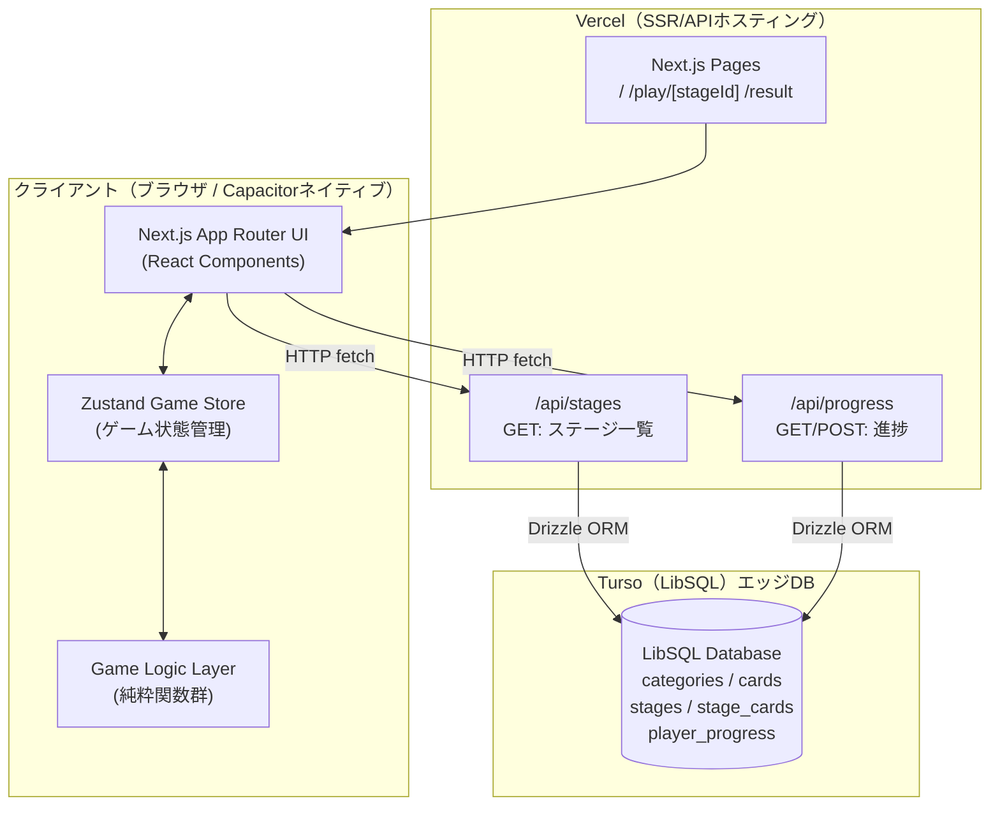

# 基本設計書: ワードソリティア

## 1. 全体アーキテクチャ



### アーキテクチャ方針
- **ゲームロジックはクライアント完結**: Zustand + 純粋関数でゲーム状態を管理し、Capacitorモバイル版でもそのまま動作する
- **APIは最小限**: DBアクセスはステージデータ取得と進捗保存の2種のみ
- **BUILD_TARGET切り替え**: 環境変数で Web版（Vercel/SSR）とモバイル版（静的エクスポート）を切り替え

---

## 2. Next.js App Router ページ・ルート構成

### 2.1 ページ構成

```
src/app/
├── page.tsx                    → / : ゲーム選択/スタート画面
├── play/
│   └── [stageId]/
│       └── page.tsx            → /play/[stageId] : ゲームプレイ画面
├── result/
│   └── page.tsx                → /result : クリア/失敗結果画面
├── api/
│   ├── stages/
│   │   └── route.ts            → GET /api/stages : ステージ一覧
│   └── progress/
│       └── route.ts            → GET /api/progress, POST /api/progress : プレイヤー進捗
├── layout.tsx                  → ルートレイアウト（フォント・メタ情報）
└── globals.css                 → グローバルスタイル（Tailwind v4）
```

### 2.2 各ページの責務

| パス | ページ名 | 責務 | データ取得方法 |
|------|---------|------|--------------|
| `/` | スタート画面 | ステージ選択・プレイ開始ボタン | Client fetch → /api/stages |
| `/play/[stageId]` | ゲームプレイ画面 | ゲームUI全体・状態管理 | Client fetch → /api/stages?id={stageId} |
| `/result` | 結果画面 | クリア/失敗表示・リトライ/次ステージ | Zustand（ゲーム完了時の状態から） |

### 2.3 APIルート仕様（概要）

| エンドポイント | メソッド | 説明 |
|--------------|--------|------|
| `/api/stages` | GET | ステージ一覧（全ステージのID・名前・手数）を返す |
| `/api/stages?id={stageId}` | GET | 特定ステージのカード・カテゴリ含む詳細データを返す |
| `/api/progress` | GET | プレイヤーの進捗一覧（?playerId=xxx）を返す |
| `/api/progress` | POST | クリア記録・ベスト手数を保存する |

---

## 3. コンポーネント構成

```
src/components/game/
├── GameContainer.tsx            → ゲームUI全体を束ねるコンテナ
│   ├── GameHeader.tsx           → ヘッダー行（手数・山札残数表示）
│   ├── DeckArea.tsx             → 山札エリア（中央山札＋右上メイン山札）
│   │   ├── MainDeck.tsx         → 右上の山札（裏向き）
│   │   └── CenterDeck.tsx      → 中央の捨て山（表向き）
│   ├── CategoryRow.tsx          → カテゴリスロット4列
│   │   └── CategorySlot.tsx    → 各スロット（locked/empty/filled状態）
│   ├── CardStackArea.tsx        → カードスタック4列エリア
│   │   └── CardStack.tsx       → 各列のカードスタック
│   │       └── GameCard.tsx    → 個別カード（表/裏）
│   └── BoosterBar.tsx           → ブースターボタン（ヒント・アンドゥ・特殊）
│
src/components/ui/
├── Button.tsx                   → 汎用ボタン
├── Modal.tsx                    → モーダル（クリア/失敗）
└── LoadingSpinner.tsx           → ローディング表示
```

### 3.1 GameContainer
- ゲームプレイ画面全体を包むレイアウトコンポーネント
- Zustand storeからゲーム状態を受け取り各子コンポーネントに渡す
- ゲームクリア/失敗検知後にモーダルまたはresultページへ遷移

### 3.2 GameHeader
- 表示: 手数（残り手数 / 初期手数）、山札残枚数
- 手数が少なくなると色が変化（例: 10手以下で赤表示）

### 3.3 DeckArea
- 中央山札（CenterDeck）: 最後にめくられたカードを表向きで表示
- メイン山札（MainDeck）: 残り枚数を数字表示した裏向きカードの山
- メイン山札をタップ/クリックで `drawFromMainDeck()` を呼び出す

### 3.4 CategoryRow
- 4つのCategorySlotを横並びで表示
- locked: グレーアウト・鍵アイコン
- empty: 点線枠（カテゴリカード待ち）
- filled: カテゴリ名・配置済みカード数表示（例: 0/8）

### 3.5 CardStackArea
- 4列のCardStackを横並びで表示
- 各スタックは縦方向にカードが積まれ、一番下のカードのみ表向き
- 表向きカードをタップで `selectCard()` を呼び出す

### 3.6 GameCard
- 表向き: カードテキストをメインに大きく表示、type='category'は背景色を変える
- 裏向き: カード背面デザイン
- Framer Motionでめくりアニメーション・移動アニメーション

### 3.7 BoosterBar
- ヒントボタン・アンドゥボタン・特殊ブースターボタン（MVP: グレーアウト）
- 残り使用回数を表示

---

## 4. Zustand Store 設計

### 4.1 ストア構造

```typescript
// src/store/gameStore.ts

interface GameStore {
  // --- 状態 ---
  gameState: GameState | null
  isLoading: boolean
  error: string | null

  // --- アクション ---
  initGame: (stageData: StageData) => void
  drawFromMainDeck: () => void
  selectCard: (card: PlayCard, source: CardSource) => void
  placeToCategorySlot: (slotIndex: number) => void
  placeToColumnStack: (columnIndex: number) => void
  undoLastAction: () => void
  useHint: () => HintResult | null
  resetGame: () => void

  // --- 内部ヘルパー（アクション内で使用）---
  checkGameEnd: () => void
  pushHistory: (snapshot: GameState) => void
}

// アンドゥ用の履歴スタック（最大10手）
interface GameStoreInternal extends GameStore {
  history: GameState[]
}
```

### 4.2 storeの責務
- ゲーム状態（GameState）の単一ソース・オブ・トゥルース
- 全アクションは状態を不変的（immer経由）に更新
- アンドゥ用に履歴スタックを最大10件保持
- ゲーム終了判定は各アクションの末尾で自動チェック

### 4.3 CardSource 型

```typescript
type CardSource =
  | { type: 'centerDeck' }          // 中央山札から
  | { type: 'columnStack'; col: number }  // 列スタックから
```

---

## 5. Turso DB スキーマ

### 5.1 テーブル一覧とER図

```mermaid
erDiagram
    categories {
        integer id PK
        text name
        text created_at
    }
    cards {
        integer id PK
        integer category_id FK
        text text
        text type
        text created_at
    }
    stages {
        integer id PK
        text name
        integer total_moves
        text created_at
    }
    stage_cards {
        integer stage_id FK
        integer card_id FK
    }
    player_progress {
        text player_id
        integer stage_id FK
        integer cleared
        integer best_moves_remaining
        integer play_count
        text updated_at
    }

    categories ||--o{ cards : "1カテゴリ=複数カード"
    stages ||--o{ stage_cards : "1ステージ=複数カード"
    cards ||--o{ stage_cards : "1カード=複数ステージ"
    stages ||--o{ player_progress : "1ステージ=複数進捗"
```



### 5.2 テーブル定義

#### categories（カテゴリテーブル）

| カラム | 型 | 制約 | 説明 |
|--------|----|----|------|
| id | INTEGER | PK AUTOINCREMENT | カテゴリID |
| name | TEXT | NOT NULL | カテゴリ名（例: "柄"） |
| created_at | TEXT | DEFAULT CURRENT_TIMESTAMP | 作成日時（ISO8601） |

#### cards（カードテーブル）

| カラム | 型 | 制約 | 説明 |
|--------|----|----|------|
| id | INTEGER | PK AUTOINCREMENT | カードID |
| category_id | INTEGER | FK→categories.id, NULL可 | カテゴリID（カテゴリカード自体はNULL） |
| text | TEXT | NOT NULL | 表示テキスト（例: "破線"） |
| type | TEXT | NOT NULL CHECK('normal','category') | カード種別 |
| created_at | TEXT | DEFAULT CURRENT_TIMESTAMP | 作成日時 |

#### stages（ステージテーブル）

| カラム | 型 | 制約 | 説明 |
|--------|----|----|------|
| id | INTEGER | PK AUTOINCREMENT | ステージID |
| name | TEXT | NOT NULL | ステージ名（例: "ステージ1"） |
| total_moves | INTEGER | NOT NULL | 制限手数 |
| created_at | TEXT | DEFAULT CURRENT_TIMESTAMP | 作成日時 |

#### stage_cards（ステージカード中間テーブル）

| カラム | 型 | 制約 | 説明 |
|--------|----|----|------|
| stage_id | INTEGER | FK→stages.id NOT NULL | ステージID |
| card_id | INTEGER | FK→cards.id NOT NULL | カードID |
| - | - | PRIMARY KEY(stage_id, card_id) | 複合PK |

#### player_progress（プレイヤー進捗テーブル）

| カラム | 型 | 制約 | 説明 |
|--------|----|----|------|
| player_id | TEXT | NOT NULL | プレイヤーUUID |
| stage_id | INTEGER | FK→stages.id NOT NULL | ステージID |
| cleared | INTEGER | NOT NULL DEFAULT 0 | クリア済み(1=クリア, 0=未) |
| best_moves_remaining | INTEGER | NULL | ベスト残り手数 |
| play_count | INTEGER | NOT NULL DEFAULT 0 | プレイ回数 |
| updated_at | TEXT | DEFAULT CURRENT_TIMESTAMP | 更新日時 |
| - | - | PRIMARY KEY(player_id, stage_id) | 複合PK |

### 5.3 インデックス

```sql
-- カード検索の高速化
CREATE INDEX idx_cards_category_id ON cards(category_id);
CREATE INDEX idx_cards_type ON cards(type);

-- ステージカード検索の高速化
CREATE INDEX idx_stage_cards_stage_id ON stage_cards(stage_id);

-- 進捗検索の高速化
CREATE INDEX idx_player_progress_player_id ON player_progress(player_id);
```

---

## 6. Capacitor対応設計

### 6.1 BUILD_TARGET切り替え

```typescript
// next.config.ts
import type { NextConfig } from 'next'

const isMobileBuild = process.env.BUILD_TARGET === 'mobile'

const nextConfig: NextConfig = {
  output: isMobileBuild ? 'export' : undefined,
  images: {
    unoptimized: isMobileBuild,
  },
  // モバイル版ではAPIルートが使えないため、
  // クライアント側でAPIベースURLを切り替える
  env: {
    NEXT_PUBLIC_BUILD_TARGET: process.env.BUILD_TARGET ?? 'web',
    NEXT_PUBLIC_API_BASE_URL: isMobileBuild
      ? process.env.MOBILE_API_BASE_URL ?? 'https://your-vercel-app.vercel.app'
      : '',
  },
}

export default nextConfig
```

### 6.2 API呼び出しの切り替え

```typescript
// src/lib/api.ts
const API_BASE = process.env.NEXT_PUBLIC_API_BASE_URL ?? ''

export async function fetchStage(stageId: number): Promise<StageData> {
  const res = await fetch(`${API_BASE}/api/stages?id=${stageId}`)
  if (!res.ok) throw new Error('Failed to fetch stage')
  return res.json()
}
```

### 6.3 ビルドスクリプト

```json
// package.json の scripts
{
  "build": "next build",
  "build:mobile": "BUILD_TARGET=mobile next build",
  "cap:sync": "npx cap sync",
  "cap:android": "npx cap open android"
}
```

---

## 7. ディレクトリ構成（全体）

```
C:\project\WordSolitaire\
├── src/
│   ├── app/
│   │   ├── page.tsx
│   │   ├── layout.tsx
│   │   ├── globals.css
│   │   ├── play/[stageId]/page.tsx
│   │   ├── result/page.tsx
│   │   └── api/
│   │       ├── stages/route.ts
│   │       └── progress/route.ts
│   ├── components/
│   │   ├── game/
│   │   │   ├── GameContainer.tsx
│   │   │   ├── GameHeader.tsx
│   │   │   ├── DeckArea.tsx
│   │   │   ├── MainDeck.tsx
│   │   │   ├── CenterDeck.tsx
│   │   │   ├── CategoryRow.tsx
│   │   │   ├── CategorySlot.tsx
│   │   │   ├── CardStackArea.tsx
│   │   │   ├── CardStack.tsx
│   │   │   ├── GameCard.tsx
│   │   │   └── BoosterBar.tsx
│   │   └── ui/
│   │       ├── Button.tsx
│   │       ├── Modal.tsx
│   │       └── LoadingSpinner.tsx
│   ├── store/
│   │   └── gameStore.ts
│   ├── lib/
│   │   ├── db/
│   │   │   ├── client.ts          → Turso接続クライアント
│   │   │   ├── schema.ts          → Drizzle ORM スキーマ定義
│   │   │   └── seed.ts            → 初期データ投入スクリプト
│   │   ├── api.ts                 → APIフェッチ関数
│   │   └── gameLogic.ts           → ゲームロジック純粋関数群
│   └── types/
│       └── game.ts                → TypeScript型定義
├── drizzle/
│   └── migrations/                → Drizzle Kitマイグレーションファイル
├── public/
│   └── icons/                     → ゲームアイコン等
├── next.config.ts
├── drizzle.config.ts
├── package.json
├── tsconfig.json
├── tailwind.config.ts
└── .env.local                     → TURSO_DATABASE_URL, TURSO_AUTH_TOKEN
```
